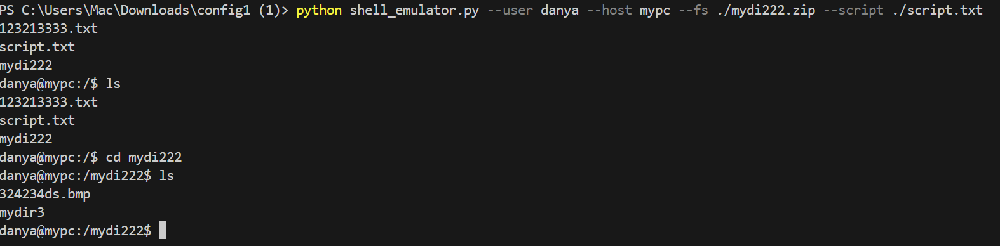
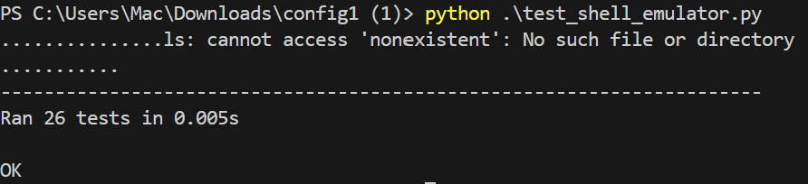

Задание №1
Разработать эмулятор для языка оболочки ОС. Необходимо сделать работу
эмулятора как можно более похожей на сеанс shell в UNIX-подобной ОС.
Эмулятор должен запускаться из реальной командной строки, а файл с
виртуальной файловой системой не нужно распаковывать у пользователя.
Эмулятор принимает образ виртуальной файловой системы в виде файла формата
zip. Эмулятор должен работать в режиме CLI.
Ключами командной строки задаются:
• Имя пользователя для показа в приглашении к вводу.
• Имя компьютера для показа в приглашении к вводу.
• Путь к архиву виртуальной файловой системы.
• Путь к стартовому скрипту.
Стартовый скрипт служит для начального выполнения заданного списка
команд из файла.
Необходимо поддержать в эмуляторе команды ls, cd и exit, а также
следующие команды:
1. chmod.
2. rm.
3. find.
Все функции эмулятора должны быть покрыты тестами, а для каждой из
поддерживаемых команд необходимо написать 2 теста.

Пример запуска программы:python shell_emulator.py --user danya --host mypc --fs ./mydi222.zip --script ./script.txt

тесты: